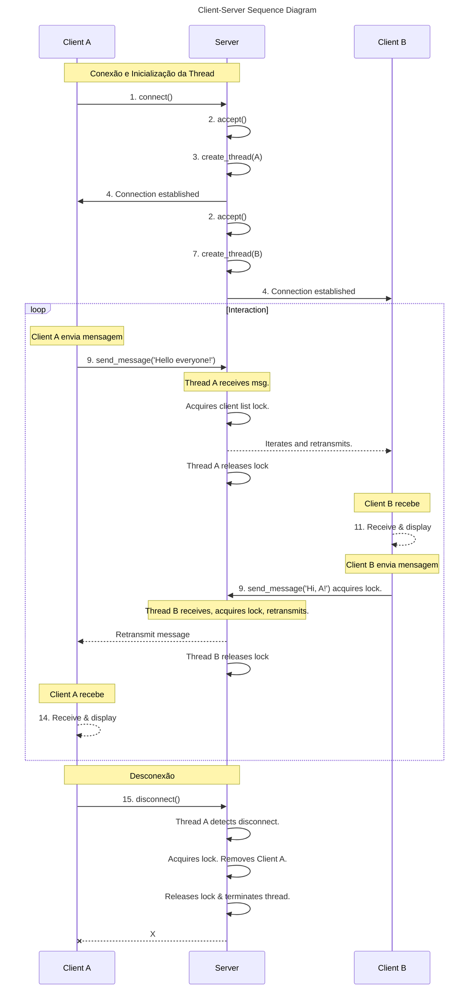

# Relatório Final

**Projeto:** Tema A - Servidor de Chat Multiusuário (TCP)

**Disciplina:** LPII

**Aluno:** Eliabe Rodrigues Pereira

**Matrícula:** 20230047490

**Professor:** Bidu (bidu@ci.ufpb.br)

**Universidade:** Universidade Federal da Paraíba (UFPB)

**Data:** 06 de Outubro de 2025

---

## 1. Resumo do Projeto

Este documento detalha a implementação de um sistema de chat multiusuário concorrente, desenvolvido como projeto final para a disciplina de Programação Concorrente. O objetivo principal foi aplicar os conceitos de **threads**, **exclusão mútua**, **sincronização** e **comunicação em rede** utilizando sockets para criar um servidor TCP robusto e um cliente de linha de comando (CLI) funcional.

O sistema consiste em um servidor que aceita múltiplas conexões de clientes simultaneamente, onde cada cliente é gerenciado por uma **thread dedicada**. As mensagens enviadas por um cliente são retransmitidas (broadcast) para todos os outros clientes conectados. O projeto também inclui um sistema de **logging concorrente** para registrar eventos importantes do servidor e dos clientes.

---

## 2. Diagrama Cliente-Servidor

A sequência de eventos mostra o uso de locks para proteger a lista de clientes durante o envio de mensagens (broadcast) e na desconexão, que envolve a remoção do cliente da lista compartilhada.

---

## 3. Mapeamento Requisitos-Código

A tabela a seguir mapeia os requisitos gerais do projeto para os trechos de código correspondentes na implementação.

| Requisito | Implementação no Código | Arquivo(s) |
| :--- | :--- | :--- |
| **1. Threads** | O servidor cria uma nova thread (`pthread_create`) para cada cliente aceito. Cada thread executa a função `handle_client` para gerenciar a comunicação com um cliente específico. | `server.c` |
| **2. Exclusão Mútua** | Um mutex (`pthread_mutex_t clients_mutex`) é usado para proteger o acesso à lista compartilhada de clientes (`client_socket_t clients[]`). Funções como `pthread_mutex_lock` e `pthread_mutex_unlock` garantem que apenas uma thread por vez possa modificar a lista. | `server.c` |
| **3. Semáforos e Condvars** | O princípio de sincronização de filas é central na biblioteca de logging para controlar o acesso concorrente. | `libtslog.c` |
| **4. Monitores** | O conceito de monitor foi aplicado na biblioteca `libtslog`, que encapsula a complexidade da sincronização e fornece uma interface segura (`tslog_log`) para que múltiplas threads possam escrever logs. | `libtslog.c`, `include/libtslog.h` |
| **5. Sockets** | A API de Sockets é usada extensivamente para a comunicação em rede, com funções como `socket`, `bind`, `listen`, `accept` no servidor e `connect`, `send`, `recv` no cliente e servidor. | `server.c`, `client.c` |
| **6. Gerenciamento de Recursos** | Os descritores de arquivo dos sockets são fechados (`close()`) quando um cliente se desconecta ou o servidor é encerrado. O tratamento de sinais garante um desligamento ordenado. | `server.c`, `client.c` |
| **7. Tratamento de Erros** | O retorno de chamadas de sistema é verificado e mensagens de erro são impressas para fornecer diagnósticos claros. | `server.c`, `client.c`, `libtslog.c` |
| **8. Logging Concorrente** | A biblioteca `libtslog` é utilizada para registrar eventos importantes de forma *thread-safe*, conforme especificado. | `server.c`, `client.c`, `libtslog.c` |
| **9. Documentação** | `README.md` contém instruções de compilação e execução. Este relatório complementa a documentação com o diagrama de sequência. | `README.md` |
| **10. Build** | Um `Makefile` funcional foi fornecido para automatizar o processo de compilação em um ambiente Linux. | `Makefile` |

---

## 4. Relatório de Análise Crítica com IA (LLM)

Esta seção documenta a análise crítica do código-fonte realizada com o auxílio de um Large Language Model (LLM) para identificar potenciais problemas de concorrência e as estratégias de mitigação adotadas.

### Análise de Problemas de Concorrência e Mitigações

1.  **Condições de Corrida (Race Conditions)**
    * **Problema Potencial:** O principal ponto de atenção é o *array* global `clients`, que armazena os sockets dos clientes conectados. Múltiplas threads acessam essa estrutura para adicionar, remover e ler a lista para transmitir mensagens.
    * **Mitigação Implementada:** Foi utilizado um `pthread_mutex_t` para garantir que todas as operações no *array* `clients` (adição, remoção e iteração para broadcast) sejam atômicas, prevenindo inconsistências.

2.  **Deadlocks**
    * **Problema Potencial:** Deadlocks poderiam ocorrer se múltiplas threads tentassem adquirir múltiplos locks em ordens diferentes.
    * **Mitigação Implementada:** O design do servidor utiliza apenas um **mutex** principal para todos os dados compartilhados. Isso elimina a condição de espera circular, uma das condições necessárias para a ocorrência de deadlocks.

3.  **Inanição (Starvation)**
    * **Problema Potencial:** A inanição poderia acontecer se uma thread fosse consistentemente preterida ao tentar adquirir o mutex.
    * **Mitigação Implementada:** O risco é baixo, pois o mutex é retido por períodos muito curtos. As operações dentro da seção crítica são rápidas (iterar sobre uma lista ou modificar um elemento), garantindo que o lock seja liberado rapidamente e diminuindo a probabilidade de que qualquer thread espere por tempo excessivo.

### Conclusão da Análise com IA

A análise do LLM confirmou que o uso de um único mutex é uma estratégia eficaz e correta para proteger a lista de clientes, prevenindo condições de corrida e deadlocks de forma robusta para este projeto.

---

## 5. Conclusão Geral

O projeto atingiu com sucesso o objetivo de desenvolver um sistema concorrente em rede. Todas as funcionalidades obrigatórias foram implementadas, e os requisitos de concorrência, comunicação e robustez foram atendidos conforme a especificação do trabalho.